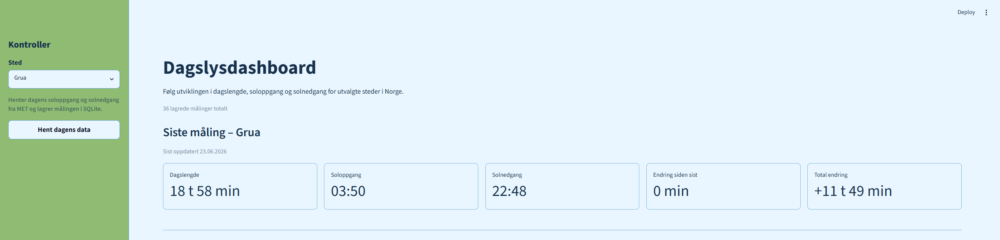
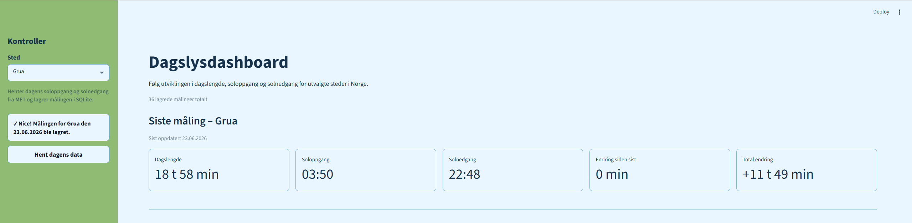
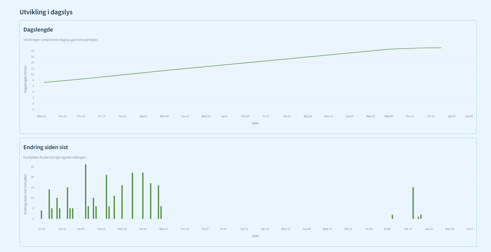
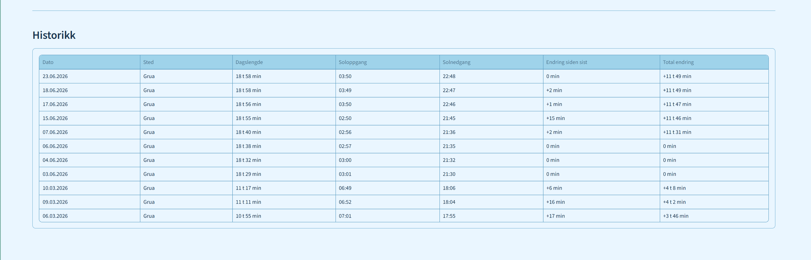

# Daylight Dashboard

A Python and Streamlit application for tracking changes in daylight length, sunrise, and sunset across selected Norwegian locations.

The project started as a pandas exercise based on manually recorded Excel data. It has since developed into a tested data pipeline that imports historical measurements, fetches current data from the MET Sunrise API, calculates daylight changes, stores measurements in SQLite, and presents the results in an interactive dashboard.

## Dashboard

### Overview



### Successful data update



### Daylight charts



### Measurement history



Older screenshots are preserved in `screenshots/progress/` to document the development of the project.

## Features

* Imports historical daylight measurements from an Excel workbook
* Normalizes Norwegian column names into consistent internal field names
* Converts Excel dates and time values with pandas
* Maps cleaned rows into typed `DaylightMeasurement` objects
* Stores measurement history in SQLite
* Fetches sunrise and sunset data from the MET Sunrise API
* Supports Grua, Oslo, Bergen, and Tromsø
* Calculates total day length
* Calculates change since the previous saved measurement
* Calculates total change since the first measurement
* Handles both increasing and decreasing daylight
* Uses the `Europe/Oslo` timezone with automatic summer and winter offsets
* Shows the latest measurement as dashboard metrics
* Displays a day-length line chart
* Displays daily daylight changes as a bar chart
* Includes a formatted measurement-history table
* Filters measurements by selected location
* Supports an empty database and first-time API updates
* Shows loading, success, empty, and error states
* Uses service-level error handling to avoid exposing technical tracebacks
* Includes automated tests for the core data flow
* Preserves JSON storage as an optional legacy storage path

## Design Process

The dashboard layout was planned with low-fidelity wireframes before implementation.

The wireframes cover:

* Normal dashboard state
* Empty database state
* Selected location without saved data
* API error state

The exported wireframes are stored in:

```text
docs/design/
```

The final interface uses a weather-inspired theme with:

* A light sky-blue main area
* A green sidebar
* Blue controls and table elements
* Green chart lines and bars
* Clear visual separation between metrics, charts, and history

## Technology

* Python
* Streamlit
* pandas
* SQLite
* requests
* pytest
* Matplotlib
* MET Sunrise API
* `ZoneInfo`
* `tzdata`

## Architecture

The application separates API access, application logic, storage, formatting, and presentation into individual modules.

### API update flow

```text
MET Sunrise API
        |
        v
API client
        |
        v
Measurement service
        |
        v
Historical calculations
        |
        v
SQLite storage
        |
        v
Streamlit dashboard
```

### Historical import flow

```text
Excel workbook
        |
        v
pandas DataFrame
        |
        v
DaylightMeasurement objects
        |
        v
SQLite storage
        |
        v
Streamlit dashboard
```

## Error Handling

The service layer exposes a single application-level exception:

```text
DaylightServiceError
```

Network failures, invalid MET responses, processing errors, and SQLite errors are converted into this predictable error type.

The dashboard can therefore display a clear error message without exposing a technical traceback to the user.

## Timezone Handling

MET Sunrise requests require a UTC offset.

The application uses:

```text
Europe/Oslo
```

The correct offset is calculated automatically for the selected date:

```text
Winter: +01:00
Summer: +02:00
```

This avoids hardcoding Norwegian winter time throughout the year.

## Project Structure

```text
.streamlit/
  config.toml             Streamlit theme configuration

data/
  Dagens lengde (2).xlsx  Historical source workbook

docs/
  design/                 Exported dashboard wireframes

screenshots/
  dashboard/
    dashboard-overview.png
    dashboard-fetch-success.png
    dashboard-charts.png
    dashboard-history.png

  progress/               Older screenshots showing project development

src/
  __init__.py
  api_client.py           MET API requests, locations, and timezone offsets
  dashboard.py            Streamlit user interface
  data_loader.py          Excel loading and column normalization
  formatting.py           User-facing date, time, and duration formatting
  main.py                 Command-line entry point
  measurement.py          DaylightMeasurement data model
  measurement_mapper.py   Converts DataFrame rows into measurement objects
  measurement_service.py  API workflow, calculations, storage, and error handling
  plotting.py             PNG chart export
  reporting.py            Terminal reporting
  sqlite_storage.py       Main SQLite storage layer
  storage.py              Optional legacy JSON storage
  time_utils.py           Duration parsing and calculations

tests/
  conftest.py
  test_api_client.py
  test_formatting.py
  test_measurement_mapper.py
  test_measurement_service.py
  test_reporting.py
  test_sqlite_storage.py
  test_storage.py
  test_time_utils.py
```

## Setup

Python 3.10 or newer is recommended.

### Create a virtual environment

```bash
python -m venv .venv
```

### Activate on Windows PowerShell

```powershell
.venv\Scripts\Activate.ps1
```

### Activate on macOS or Linux

```bash
source .venv/bin/activate
```

### Install dependencies

```bash
python -m pip install -r requirements.txt
```

## Running the Dashboard

Start Streamlit from the project root:

```bash
streamlit run src/dashboard.py
```

The dashboard supports an empty SQLite database.

Select a location in the sidebar and click **Hent dagens data** to create the first measurement.

## Importing Historical Data

Historical measurements can be imported from the Excel workbook through the command-line interface:

```bash
python -m src.main --save-sqlite --location Grua
```

The historical import is optional and is not required before starting the dashboard.

## Command-Line Usage

Run the terminal summary and preview:

```bash
python -m src.main
```

Export a PNG chart:

```bash
python -m src.main --plot output/daylight.png
```

## Running Tests

Run the complete test suite:

```bash
python -m pytest
```

The tests cover:

* MET API response parsing
* API request parameters
* Norwegian summer and winter offsets
* Day-length calculations
* Positive and negative daylight changes
* User-facing date and duration formatting
* Measurement mapping
* Service-level error handling
* SQLite storage
* Legacy JSON storage
* Terminal reporting

## Storage

SQLite is the primary storage system used by the dashboard.

Each measurement contains:

* Date
* Location
* Day length
* Sunrise
* Sunset
* Change since the previous measurement
* Total change since the first measurement
* Data source

A uniqueness constraint prevents duplicate measurements for the same date and location.

JSON storage remains available in `src/storage.py` as an optional legacy implementation.

## Current Status

The project is a working v1.0 candidate with:

* A complete Excel-to-SQLite import flow
* A working MET API-to-SQLite flow
* Multiple supported locations
* Automatic timezone handling
* Positive and negative daylight calculations
* Location filtering
* Loading and user-feedback states
* Service-level error handling
* Norwegian display formatting
* Responsive dashboard metrics
* Line and bar charts
* Measurement history
* Documented UX wireframes
* Automated tests for the core functionality

## Planned Improvements

* Add GitHub Actions for automated test execution
* Deploy the dashboard
* Add validation for unexpected Excel formats
* Add more Norwegian locations
* Add comparison views between locations
* Improve accessibility and mobile layout
* Consider optional weather and temperature data
